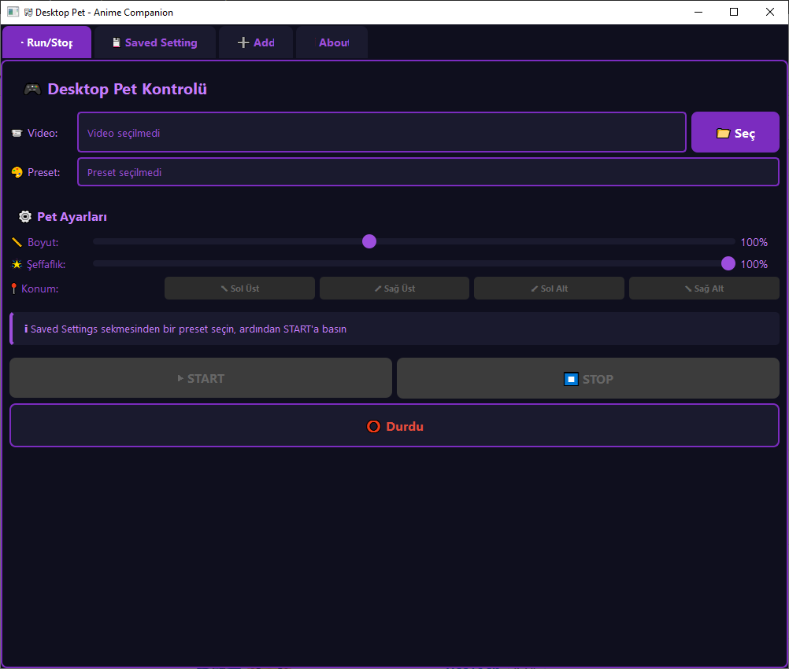

# 🎭 WaifuEngine - Desktop Pet Application

Transform your desktop with animated anime characters! WaifuEngine brings your favorite anime characters to life on your desktop with transparent backgrounds and customizable settings.




## ✨ Features

- 🎮 **Interactive Desktop Pet** - Characters move freely on your desktop
- 🔍 **Chroma Key Transparency** - Full transparency with customizable HSV color keying
- 🎨 **Preset System** - Save and reuse your favorite color settings
- 📏 **Customizable Size** - Scale your pet from 25% to 200%
- 🌟 **Opacity Control** - Adjust transparency from 20% to 100%
- 📍 **Position Presets** - Quick positioning to screen corners
- 💾 **Persistent Settings** - Save unlimited color presets
- 🔄 **Live Preview** - Test your HSV settings in real-time
- 🖱️ **Drag & Drop** - Move your pet anywhere on screen
- 🔝 **Always on Top** - Pet stays above all windows

## 🖼️ Screenshots

### Main Control Panel
Control your desktop pet with an intuitive purple-themed interface featuring size, opacity, and position controls.

### HSV Color Adjustment
Fine-tune chroma key settings with real-time preview to achieve perfect transparency for any background color.

### Saved Presets Gallery
Manage multiple color presets for different videos and backgrounds.

## 📋 Requirements

```
Python 3.7+
PyQt5
OpenCV (cv2)
```

## 🚀 Installation

1. **Clone the repository**
```bash
git clone https://github.com/hudulovhamzat0/WaifuEngine.git
cd WaifuEngine
```

2. **Install dependencies**
```bash
pip install PyQt5 opencv-python
```

3. **Run the application**
```bash
python desktop_pet.py
```

## 📖 How to Use

### First-Time Setup

1. **Create a Color Preset**
   - Go to the `➕ Add` tab
   - Load a test video to preview
   - Adjust HSV sliders to remove background color
   - Save your preset with a descriptive name

2. **Select Your Settings**
   - Navigate to `💾 Saved Settings` tab
   - Click on your saved preset to select it

3. **Launch Your Pet**
   - Go to `▶ Run/Stop` tab
   - Click `📁 Seç` to select your character video
   - Adjust size and opacity as desired
   - Click `▶ START` to launch your desktop pet!

### HSV Color Adjustment Guide

For best results with chroma key:

**Green Screen Videos** (Common preset)
- Lower HSV: `(40, 40, 40)`
- Upper HSV: `(80, 255, 255)`

**Blue Screen Videos**
- Lower HSV: `(100, 100, 100)`
- Upper HSV: `(130, 255, 255)`

**Black Background**
- Lower HSV: `(0, 0, 0)`
- Upper HSV: `(179, 255, 30)`

**White Background**
- Lower HSV: `(0, 0, 200)`
- Upper HSV: `(179, 30, 255)`

### Tips for Perfect Transparency

- 🎯 **Hue**: Defines the color range (0-179)
- 💧 **Saturation**: Controls color intensity (0-255)
- 💡 **Value**: Controls brightness (0-255)
- 🔄 Use the live preview to test settings
- 📊 Start with wider ranges and narrow down
- 💾 Save multiple presets for different lighting conditions

## 🎮 Controls

### During Pet Operation

- **Left Click + Drag**: Move the pet around screen
- **Position Buttons**: Snap to screen corners
- **Scale Slider**: Resize pet (25% - 200%)
- **Opacity Slider**: Adjust transparency (20% - 100%)
- **STOP Button**: Close the desktop pet

## 📁 Project Structure

```
WaifuEngine/
├── desktop_pet.py          # Main application file
├── color_presets.json      # Saved HSV presets (auto-generated)
├── README.md               # This file
└── videos/                 # Your anime character videos
```

## 🎬 Recommended Video Formats

- **Formats**: MP4, AVI, MOV
- **Background**: Solid color (green, blue, or black works best)
- **Resolution**: Any (app will scale automatically)
- **Duration**: Looping videos work great!

## 🛠️ Technical Details

### Built With

- **PyQt5** - Modern GUI framework
- **OpenCV** - Video processing and chroma key
- **Python** - Core programming language

### Key Classes

- `DesktopPet` - Transparent, draggable pet window
- `ControlPanel` - Main control interface
- `SavedSettingsWidget` - Preset management
- `AddPresetWidget` - HSV adjustment tool
- `AboutWidget` - Application information

## 🐛 Troubleshooting

**Pet not appearing?**
- Verify video file exists and is readable
- Check if HSV values match your background color
- Try adjusting opacity slider

**Background not transparent?**
- Fine-tune HSV sliders in Add tab
- Use live preview to test settings
- Save working values as preset

**Application crashes on start?**
- Ensure all dependencies are installed
- Check Python version (3.7+ required)
- Verify video codecs are supported

## 🤝 Contributing

Contributions are welcome! Feel free to:

1. Fork the project
2. Create your feature branch (`git checkout -b feature/AmazingFeature`)
3. Commit your changes (`git commit -m 'Add some AmazingFeature'`)
4. Push to the branch (`git push origin feature/AmazingFeature`)
5. Open a Pull Request

## 📝 To-Do

- [ ] Add multiple pets support
- [ ] Implement pet interactions
- [ ] Add animation triggers
- [ ] Sound effects support
- [ ] Auto-update checker
- [ ] Video editor integration
- [ ] Community preset sharing

## 📄 License

This project is licensed under the MIT License - see the [LICENSE](LICENSE) file for details.

## 👨‍💻 Developer

**Developed by [@hudulovhamzat0](https://github.com/hudulovhamzat0)**

- GitHub: [github.com/hudulovhamzat0](https://github.com/hudulovhamzat0)
- Issues: [Report a bug](https://github.com/hudulovhamzat0/WaifuEngine/issues)

## 💜 Acknowledgments

- Thanks to the anime community for inspiration
- PyQt5 and OpenCV teams for amazing tools
- All contributors and users of WaifuEngine

## ⭐ Show Your Support

If you like this project, please give it a ⭐ on GitHub!

---

<div align="center">
Made with 💜 for anime lovers everywhere
</div>
